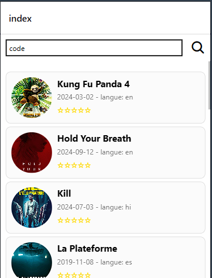

# Application de Consultation des Livres

Cette application mobile permet de consulter et rechercher des livres à partir d'une base de données. Elle est développée avec **React Native** et utilise l'API `TheMovieDB` pour récupérer les informations.

## Fonctionnalités

- **Recherche de livres** : Vous pouvez rechercher un livre par titre grâce à une barre de recherche dynamique.
- **Affichage des détails des livres** : Pour chaque livre, il est possible de consulter les détails tels que le titre, la date de sortie, le résumé, et la note.
- **Pagination** : Les livres sont chargés progressivement lorsque l'utilisateur atteint la fin de la liste.

## Installation

1. Clonez ce dépôt.
2. Installez les dépendances avec `npm install`.
3. Exécutez l'application avec `npm start`.

## Aperçu de l'application

### Vue d'Index des Livres

### Vue Détails d'un Livre

## Dépendances principales

- React Native
- Expo
- Expo Router
- API TheMovieDB

## Comment utiliser

1. Sur la page d'accueil, une liste de livres est affichée avec une barre de recherche.
2. En cliquant sur un livre, vous accédez aux détails de ce dernier.
